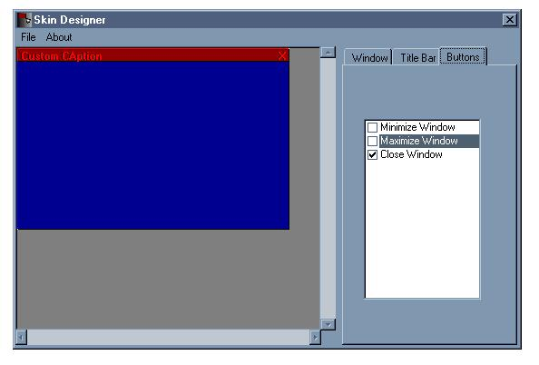

## Skin Editor v1\.0

### Description

this is a program that lets you load/save skins for programs, and then compile it into a bitmap for display in your vb progs. i believe this is original to this site (if its not plz tell me). and if people like it i will continue with it. please vote and comment!
 
### More Info
 

             |
---                |---
**Submitted On**   |2002-04-12 21:14:32
**By**             |[poop\_4\_brains](https://github.com/Planet-Source-Code/PSCIndex/blob/master/ByAuthor/poop-4-brains.md)
**Level**          |Intermediate
**User Rating**    |4.9 (49 globes from 10 users)
**Compatibility**  |VB 6\.0
**Category**       |[Coding Standards](https://github.com/Planet-Source-Code/PSCIndex/blob/master/ByCategory/coding-standards__1-43.md)
**World**          |[Visual Basic](https://github.com/Planet-Source-Code/PSCIndex/blob/master/ByWorld/visual-basic.md)
**Archive File**   |[Skin\_Edito714894122002\.zip](https://github.com/Planet-Source-Code/poop-4-brains-skin-editor-v1-0__1-33751/archive/master.zip)

